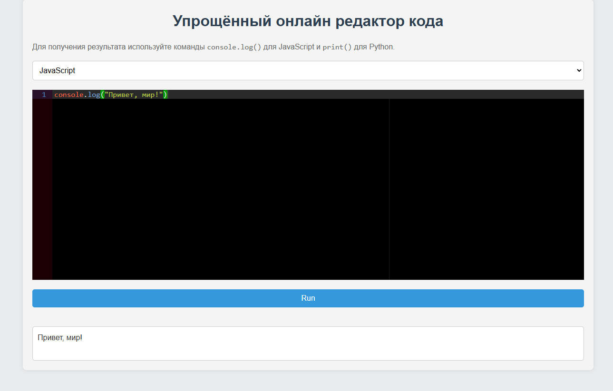

# Упрощённый онлайн редактор кода

## Краткое описание

Упрощённый онлайн редактор кода для JavaScript и Python. Пользователи могут писать код, запускать его и получать вывод или ошибки. Редактор не выполняет реальный код, а возвращает моковые ответы для `console.log()` и `print()`. Используются библиотеки AceEditor и MirageJS для удобного редактирования и мокирования API.

## Технологии

- **React**: для интерфейса.
- **Vite**: для сборки.
- **pnpm**: для управления зависимостями.
- **Ace Editor**: для редактирования кода.
- **MirageJS**: для мокирования API.
- **Sass**: для стилей.
- **ESLint**: для анализа кода.

## Инструкции по установке и запуску

### Установка

1. **Склонируйте репозиторий**:

    ```bash
   git clone https://github.com/veluat/test-code-editor.git
   cd test-code-editor
    ```

2. **Установите зависимости**:

    ```bash
    pnpm install
    ```

### Запуск

1. **Запустите приложение**:

    ```bash
    pnpm run dev
    ```
   
   Откройте браузер и перейдите по адресу: `http://localhost:5173`

## Использование MirageJS

MirageJS обрабатывает POST-запросы на /api/run, возвращая мокированные данные для console.log() и print().

## Ограничения функционала

- Поддержка только JavaScript и Python.
- Не выполняет реальный код, только мокированные ответы.
- Код не сохраняется между сессиями.

## Варианты расширения приложения

- Исполнение кода в реальном времени.
- Поддержка других языков (Ruby, PHP, Java).
- Сохранение кода в базе данных.
- Улучшение обработки ошибок.
- Улучшение интерфейса (автозаполнение, темная тема).

## Скриншот редактора

